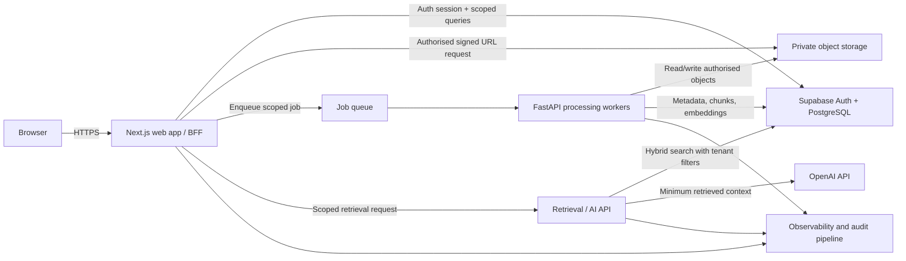

# System architecture

## 1. Architecture overview



The Next.js application is the browser-facing backend-for-frontend (BFF). Supabase supplies identity and PostgreSQL. Private object storage holds original and rendered files. FastAPI workers process uploads and power retrieval/AI endpoints. Long-running extraction, embedding, and comparison work runs asynchronously through a durable queue rather than inside a request.

## 2. Deployable components

| Component | Responsibility | Trust level |
|---|---|---|
| Next.js client | UI state, accessible interactions, direct signed uploads | Untrusted; no privileged keys |
| Next.js BFF | Session validation, tenant context, RBAC, invitation flows, metadata/MDR APIs, signed URL issuance | Internet-facing trusted service |
| Supabase Auth | Registration, verification, login, password reset, session lifecycle | Identity authority |
| PostgreSQL + pgvector | Tenant records, RLS, full-text indexes, embeddings, audit data | Primary system of record |
| Private object storage | Original, quarantine, rendered, preview, and comparison artifacts | Private; signed access only |
| Queue | Durable, retryable, scoped processing messages | Internal |
| FastAPI service/workers | Validation, malware scan integration, extraction, rendering, chunking, embeddings, comparison, retrieval | Private trusted service |
| ClamAV daemon | Signature-based streaming scan of quarantined uploads before any document parser runs | Private security service; unauthenticated port never exposed publicly |
| OpenAI API | Embeddings and answer generation from minimum authorised context | External processor |
| Email provider | Invitation and transactional email | External processor |
| Observability | Redacted logs, metrics, traces, alerts | Restricted operations access |

## 3. Tenant isolation model

Tenant isolation is enforced in layers, not only in UI code:

1. Supabase Auth establishes the user identity.
2. The BFF resolves the active organisation from the request and verifies active membership.
3. All tenant-owned rows carry `organisation_id`; project-owned rows additionally carry `project_id` with composite foreign keys that prevent cross-organisation relationships.
4. PostgreSQL RLS checks active membership and role for each user-scoped query. Policies use stable database functions and indexed membership columns.
5. Internal services use a separate least-privilege database role. Each transaction sets verified tenant/user context; service access is not exposed to browsers.
6. Storage keys use `organisations/{org_id}/projects/{project_id}/documents/{document_id}/revisions/{revision_id}/...`. The server derives this key; clients cannot choose tenant prefixes.
7. Cache keys, queue messages, search filters, telemetry, and rate-limit keys include immutable organisation and project identifiers.
8. AI retrieval applies mandatory tenant/project predicates before vector ranking; selected revision IDs are re-authorised server-side.

The Supabase service-role secret is restricted to controlled server processes and never used as a substitute for application authorisation.

## 4. Critical flows

### Upload and processing

```mermaid
sequenceDiagram
  participant B as Browser
  participant W as Next.js BFF
  participant DB as PostgreSQL
  participant OS as Object storage
  participant P as FastAPI worker

  B->>W: Request upload with metadata
  W->>DB: Authorise role; create pending revision/upload
  W-->>B: Short-lived signed upload URL + fixed storage key
  B->>OS: Upload bytes
  B->>W: Complete upload (checksum, size)
  W->>OS: Verify object metadata
  W->>DB: Mark quarantined; enqueue scoped job
  P->>OS: Fetch quarantined object
  P->>P: Signature/size/malware validation
  P->>P: Extract/render/chunk/embed
  P->>DB: Transactionally store artifacts and provenance
  P->>OS: Store rendered/preview artifacts
  P->>DB: Mark revision ready or failed; append audit event
```

Files are unavailable for normal download until validation succeeds. Failed files remain quarantined according to a short retention policy.

### Cited AI question

1. The BFF authenticates the session and authorises project access.
2. The service re-authorises every selected revision and rejects mixed-project or mixed-tenant selections.
3. Query embedding and hybrid search run with mandatory organisation/project/revision predicates.
4. Retrieved chunks carry immutable provenance: document number snapshot, revision snapshot, page/sheet locator, and artifact hash.
5. The model receives a constrained instruction, the user question, and bounded retrieved context with source IDs.
6. The server accepts only structured output whose citation IDs exist in the retrieved set; invalid citations are removed or the answer is rejected/regenerated within a bounded policy.
7. The question, answer, retrieval evidence, citations, and usage are saved and audited.

### Revision comparison

The BFF verifies both revisions belong to the same logical document and tenant. A worker compares normalised page blocks and metadata, stores a versioned result, and returns signed links to derived artifacts. Results are invalidated when the comparison engine version changes.

## 5. Security architecture

- **Authentication:** verified email; secure, HttpOnly, SameSite cookies; short session lifetime with refresh rotation; MFA-ready design; generic authentication errors.
- **Authorisation:** central capability map in application code plus RLS as independent enforcement. Mutating endpoints verify role and resource ancestry.
- **Network:** TLS everywhere; FastAPI and queue are private where hosting permits; service-to-service authentication with rotated scoped credentials.
- **Secrets:** platform secret manager only; separate development/staging/production credentials; never expose OpenAI or service-role keys through `NEXT_PUBLIC_*`.
- **Files:** allowlist, magic-byte validation, decompression/zip-bomb limits, malware scan, checksum, quarantine, filename normalisation, and no execution of macros.
- **Web:** CSRF protection for cookie-authenticated mutations, CSP, HSTS, frame protections, safe content disposition, output encoding, and request/body limits.
- **Abuse controls:** per-user/per-tenant rate limits for auth, signed URLs, search, upload, and AI; quotas/entitlements checked before expensive work.
- **Audit:** append-only application access; sensitive fields redacted; database owner access tightly controlled; optional hash chaining/WORM export post-MVP.
- **AI safety:** prompt and retrieved content are untrusted data; tool use is disabled for document QA; instructions embedded in documents cannot override system policy; citations are programmatically verified.
- **Lifecycle:** retention jobs remove expired invitations, quarantined failures, derived artifacts, and deleted-tenant data according to policy. Backups follow the same residency and access controls.

## 6. Processing and citation design

- PDF: extract per page; OCR only when needed and enabled; store page number and bounding boxes when available.
- DOCX: render to PDF in a sandboxed worker, extract from the rendered pages, and retain logical headings as secondary locators.
- XLSX: render defined print areas/sheets to paginated PDF where practical; retain sheet and cell range alongside page provenance.
- DWG: retain the quarantined original for controlled download and revision history. A later sandboxed CAD adapter will verify the binary signature, generate a viewable artifact, and extract drawing text; DWG content is not indexed until that validation succeeds.
- Each chunk stores character/token counts, content hash, extraction version, ordinal, page range, optional bounding boxes, and source artifact ID.
- A revision is searchable only after all required chunks and indexes are committed.
- Reprocessing creates a new processing run and replaces the active derived set atomically; the original revision file remains immutable.

## 7. Reliability and operations

- Jobs are idempotent using a unique `(revision_id, pipeline_version)` key.
- Retries use exponential backoff with a dead-letter state; poison files do not block the queue.
- Transactional outbox records coordinate database state and queue publication.
- Health endpoints distinguish liveness and readiness. Metrics cover queue age, processing failures, extraction duration, search latency, AI latency/cost, and permission denials.
- Database backups and point-in-time recovery are enabled; storage versioning/retention is configured where supported.
- Environments use separate projects/databases/buckets and cannot share customer data.

## 8. Proposed repository layout after approval

```text
apps/web/                 Next.js application and BFF
services/processor/       FastAPI API and workers
packages/contracts/       Generated/shared API contracts
packages/ui/              Shared UI components
supabase/migrations/      Schema, functions, RLS, storage policies
supabase/tests/           Database/RLS isolation tests
tests/e2e/                Browser and end-to-end permission tests
infra/                    Deployment configuration
docs/                     Product and engineering documentation
```
