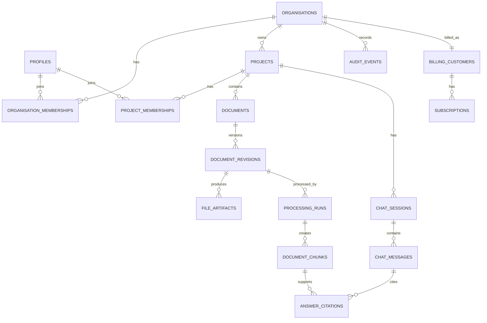

# Database schema

## 1. Conventions

- PostgreSQL UUID primary keys use `gen_random_uuid()`; `auth.users.id` is the identity key.
- Tenant-owned tables include non-null `organisation_id`. Project-owned tables include both `organisation_id` and `project_id`.
- Timestamps are `timestamptz` in UTC. Mutable tables include `created_at`, `updated_at`, and where relevant `created_by`/`updated_by`.
- Human-facing identifiers are unique within their natural tenant scope; internal relationships use UUIDs.
- Files and revisions are immutable. Corrections create a new revision or processing run.
- Soft-deactivation is used for memberships and projects; legal deletion is a controlled asynchronous workflow.
- Every cross-table tenant relationship uses composite uniqueness/foreign keys where practical, preventing a project from one organisation being attached to a row from another.

## 2. Extensions and enums

Extensions: `pgcrypto`, `vector`, `citext` (and Supabase-supported full-text facilities).

Key enums:

- `organisation_role`: `organisation_admin`, `member`
- `project_role`: `project_admin`, `document_controller`, `engineer`, `viewer`
- `membership_status`: `active`, `suspended`, `removed`
- `invitation_status`: `pending`, `accepted`, `revoked`, `expired`
- `revision_state`: `pending_upload`, `quarantined`, `processing`, `ready`, `failed`, `superseded`
- `subscription_status`: `trialing`, `active`, `past_due`, `paused`, `cancelled`

## 3. Entity relationship model

## 4. Tables

### Identity, organisations, and projects

| Table | Important columns and constraints |
|---|---|
| `profiles` | `id PK/FK auth.users`, `display_name`, `email_snapshot`, timestamps. Email snapshot is display-only; Auth remains authoritative. |
| `organisations` | `id`, `slug UNIQUE`, `name`, `settings jsonb`, `status`, timestamps. Validate settings with application/schema checks. |
| `organisation_memberships` | `id`, `organisation_id`, `user_id`, `role`, `status`, timestamps; `UNIQUE (organisation_id, user_id)`; indexed `(user_id, status)`. |
| `projects` | `id`, `organisation_id`, `code`, `name`, `description`, `status`, timestamps; `UNIQUE (organisation_id, code)` and `UNIQUE (organisation_id, id)`. |
| `project_memberships` | `id`, `organisation_id`, `project_id`, `user_id`, `role`, `status`, timestamps; `UNIQUE (project_id, user_id)`; composite FKs to organisation/project and organisation membership. |
| `invitations` | `id`, `organisation_id`, nullable `project_id`, `email citext`, `organisation_role`, `project_role`, `token_hash`, `expires_at`, `status`, `invited_by`, `accepted_by`, timestamps; token hash unique; one active invitation per email/scope/role. Never store the plaintext token. |

### Documents and processing

| Table | Important columns and constraints |
|---|---|
| `documents` | `id`, `organisation_id`, `project_id`, `document_number`, `title`, `document_type`, `discipline`, `originator`, `tags text[]`, `current_revision_id` (deferred FK), timestamps; `UNIQUE (project_id, document_number)`; `UNIQUE (organisation_id, project_id, id)`. |
| `document_revisions` | `id`, `organisation_id`, `project_id`, `document_id`, `revision_code`, `status`, `issue_date`, `revision_state`, `original_filename`, `declared_mime`, `detected_mime`, `byte_size`, `sha256`, `storage_key`, `uploaded_by`, timestamps; `UNIQUE (document_id, revision_code)`, `UNIQUE (storage_key)`, `UNIQUE (organisation_id, project_id, id)`. |
| `upload_sessions` | `id`, tenant/project/revision IDs, `storage_key`, `expected_size`, `expected_sha256`, `expires_at`, `completed_at`, `created_by`; short retention; one active session per revision. |
| `file_artifacts` | `id`, tenant/project/revision IDs, `kind` (`original`, `rendered_pdf`, `preview`, `comparison`), `storage_key`, `mime_type`, `byte_size`, `sha256`, `page_count`, timestamps; unique revision/kind/version as applicable. |
| `processing_runs` | `id`, tenant/project/revision IDs, `pipeline_version`, `state`, `attempt`, `started_at`, `finished_at`, `error_code`, safe `error_detail`, extraction metrics; `UNIQUE (revision_id, pipeline_version)`. |
| `document_chunks` | `id`, tenant/project/revision/run/artifact IDs, `ordinal`, `content`, generated/stored `search_vector`, `embedding vector(N)`, `page_start`, `page_end`, `sheet_name`, `cell_range`, `bounding_boxes jsonb`, `token_count`, `content_hash`; unique run/ordinal. Use an embedding dimension that matches the approved model. |
| `revision_comparisons` | `id`, tenant/project/document IDs, `base_revision_id`, `target_revision_id`, `engine_version`, `state`, `summary jsonb`, `artifact_id`, timestamps; unique ordered pair/engine. Validate both revisions belong to the document. |

### Chat, audit, and billing readiness

| Table | Important columns and constraints |
|---|---|
| `chat_sessions` | `id`, tenant/project IDs, `title`, `created_by`, timestamps. |
| `chat_session_revisions` | tenant/project/session/revision IDs; composite PK; records explicit authorised chat scope. |
| `chat_messages` | `id`, tenant/project/session IDs, `role`, `content`, `model`, `provider_request_id`, `prompt_tokens`, `completion_tokens`, `latency_ms`, `created_by`, `created_at`; content retention follows policy. |
| `answer_citations` | `id`, tenant/project/message/chunk/revision IDs, `citation_label`, `document_number_snapshot`, `revision_code_snapshot`, `page_start`, `page_end`, `sheet_name`, `cell_range`, `quote_excerpt`, `rank`, `score`; only citations to retrieved chunks are permitted. |
| `retrieval_events` | `id`, tenant/project/user/message IDs, normalised query or safe hash, filters, candidate chunk IDs/scores, algorithm version, created_at; restrict access and retention. |
| `audit_events` | `id` (time-sortable UUID recommended), `organisation_id`, nullable `project_id`, nullable `actor_user_id`, `action`, `target_type`, `target_id`, `outcome`, `request_id`, `ip inet`, `user_agent`, `changes jsonb`, `created_at`; no update/delete grants to application roles; partition by time at scale. |
| `billing_customers` | `id`, `organisation_id UNIQUE`, nullable provider/customer reference, billing email, timestamps. |
| `plans` | `id`, `code UNIQUE`, `name`, `entitlements jsonb`, `active`, timestamps. Plan data is platform-managed, not tenant-writable. |
| `subscriptions` | `id`, `organisation_id`, `billing_customer_id`, `plan_id`, `status`, period/trial timestamps, provider subscription reference; constrain to one current subscription per organisation. |
| `usage_ledger` | `id`, `organisation_id`, nullable `project_id/user_id`, `metric`, `quantity`, `occurred_at`, `idempotency_key UNIQUE`, source reference; append-only. |
| `outbox_events` | `id`, tenant IDs, `topic`, `aggregate_type/id`, `payload jsonb`, `created_at`, `published_at`, `attempts`; payload contains identifiers, not document text. |

## 5. Indexing and retrieval

- B-tree: all foreign keys; `(organisation_id, status)`; `(project_id, document_number)`; `(project_id, updated_at DESC)`; membership lookup combinations.
- Full text: GIN on `document_chunks.search_vector`; optionally weighted metadata search on documents.
- Vector: HNSW or IVFFlat index selected after representative benchmarks. Queries must include tenant/project filtering; use partitioning or iterative scans when necessary to preserve recall under filters.
- MDR filters: indexes on `(project_id, document_type)`, `(project_id, discipline)`, `(project_id, status)`, and revision issue date.
- Audit: `(organisation_id, created_at DESC)`, `(project_id, created_at DESC)`, `(actor_user_id, created_at DESC)`, `(target_type, target_id, created_at DESC)`.
- Avoid indexing unrestricted JSON; promote frequently queried fields to typed columns.

Hybrid search combines normalised full-text rank and vector similarity (for example reciprocal-rank fusion), then applies metadata filters. Exact document-number matches receive a deterministic boost.

## 6. RLS policy model

RLS is enabled on every tenant-owned table. Policies call security-definer helper functions with a fixed `search_path`, owned by a non-login role, and executable only by the required database roles:

- `is_org_member(org_id, minimum_state)`
- `is_org_admin(org_id)`
- `project_role(org_id, project_id)`
- `can_project(org_id, project_id, capability)`

Representative intent:

| Resource | Select | Insert/update/delete |
|---|---|---|
| Organisation | Active member | Organisation admin; creation through controlled onboarding RPC |
| Project | Organisation admin or active project member | Project admin capability; archive rather than delete |
| Membership/invitation | Relevant member (limited columns) or admin | Appropriate organisation/project admin; no self-escalation |
| Document/revision/chunk | Authorised project member | Upload/edit roles; chunks only internal processor |
| Chat | Session creator and authorised project members per policy | Authorised project member; immutable assistant records from server |
| Audit | Organisation/project admins | Insert through controlled function; no application update/delete |
| Billing | Organisation admin | Controlled server/webhook functions only |

All insert/update policies use both `USING` and `WITH CHECK`. Membership changes prevent the last organisation administrator from being removed and prevent project admins from granting organisation roles. Storage policies mirror database membership but signed URL creation remains server-side.

## 7. Database invariants and tests

- Composite FKs guarantee matching `organisation_id` across project, document, revision, chunk, chat, and citation rows.
- Triggers reject changes to immutable revision/file identity fields after upload completion.
- A transactional function advances `documents.current_revision_id` only to a ready revision belonging to that document.
- Citation insertion verifies message, chunk, revision, project, and organisation ancestry and that the chunk was in the recorded retrieval set.
- Audit tables deny update/delete to application roles.
- SQL tests execute as users from two organisations and every project role, covering select/insert/update/delete, RPCs, membership suspension, role changes, invitation replay, and object-prefix substitution.
